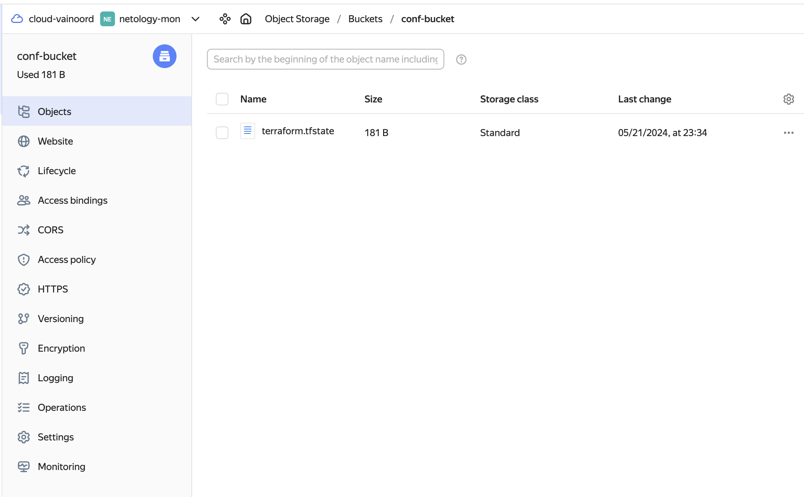

# Дипломный практикум в Yandex.Cloud

Текст задания доступен по [ссылке](https://github.com/netology-code/devops-diplom-yandexcloud/blob/main/README.md).

## Выполнение

### Создание облачной инфраструктуры

Перед инициализацией проекта укажем в `TF_CLI_CONFIG_FILE` путь до переменной .terraformrc: `export TF_CLI_CONFIG_FILE=/path/to/.terraformrc`. В сам файл закинем  следующее содержимое:  

```tf
provider_installation {
  network_mirror {
    url = "https://terraform-mirror.yandexcloud.net/"
    include = ["registry.terraform.io/*/*"]
  }
  direct {
    exclude = ["registry.terraform.io/*/*"]
  }
```
Далее создаем tf файлы для конфигурации сервисного аккаунта, провайдера, static key и bucket для хранения конфигурации. Нам далее будут необходимы значения `access_key` и `secret_key`. добавим их в `output.tf`. Помещаем файлы tf в директорию [stage 1](infrastructure/stage_1). 
Оттуда выполняем команду `terraform init`. Получаем на выходе:

```bash
Apply complete! Resources: 4 added, 0 changed, 0 destroyed.

Outputs:

access_key = "YCA...blah..."
secret_key = "YCA...blah..."
```

Полученные значения записываем в переменные:

```bash
export ACCESS_KEY="<key_ID>"
export SECRET_KEY="<secret_key>"
```

Добавляем в секцию `terraform` файла `providers.tf` backend "S3" согласно [официальной документации](https://yandex.cloud/en/docs/tutorials/infrastructure-management/terraform-state-storage?utm_referrer=https%3A%2F%2Fwww.google.com%2F#set-up-backend). Параметры `access_key` и `secret_key` получаем из ранее полученного вывода terraform или командами `terraform output secret_key`, `terraform output secret_key`:

```tf
backend "s3" {
  endpoints = {
    s3 = "https://storage.yandexcloud.net"
  }
  bucket = "conf-storage-bucket"
  region = "ru-central1-a"
  key    = "terraform.tfstate"

  skip_region_validation      = true
  skip_credentials_validation = true
  skip_requesting_account_id  = true # This option is required to describe backend for Terraform version 1.6.1 or higher.
  skip_s3_checksum            = true # This option is required to describe backend for Terraform version 1.6.3 or higher.
}
```

Далее выполняем команду `terraform init -backend-config="access_key=$ACCESS_KEY" -backend-config="secret_key=$SECRET_KEY"`. На этом подготовка облачной конфигурации завершена.

<details>
<summary>Bucket screenshot</summary>

</details>

### Создание Kubernetes кластера


###

