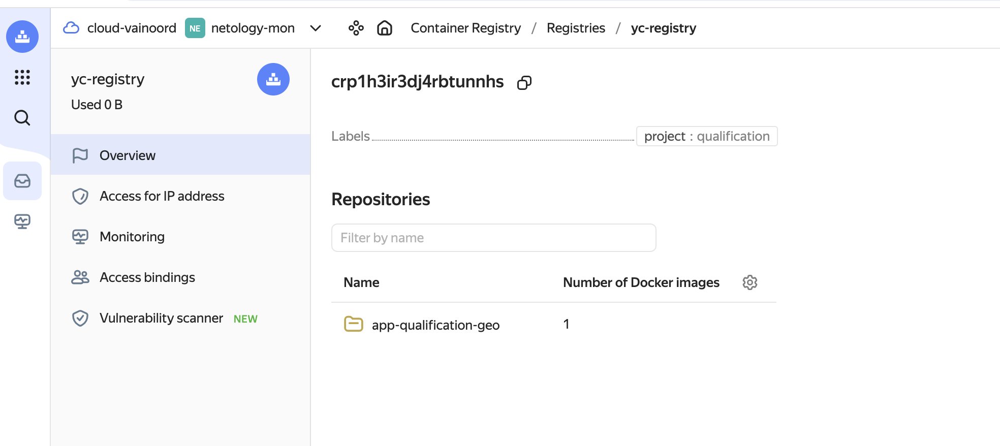
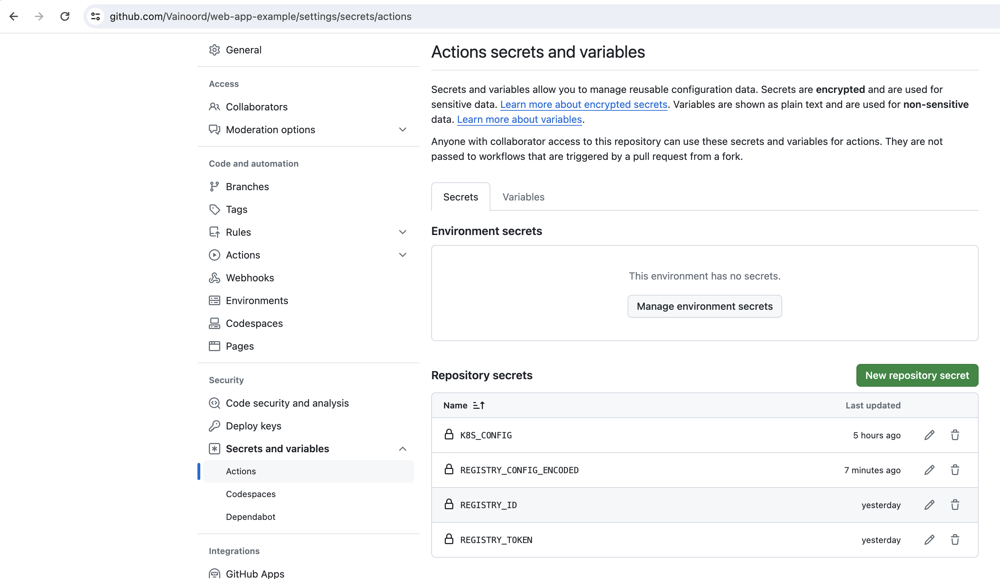

# Дипломный практикум в Yandex.Cloud

Текст задания доступен по [ссылке](https://github.com/netology-code/devops-diplom-yandexcloud/blob/main/README.md).

## Выполнение

### Создание облачной инфраструктуры

Перед инициализацией проекта укажем в `TF_CLI_CONFIG_FILE` путь до переменной .terraformrc: `export TF_CLI_CONFIG_FILE=/path/to/.terraformrc`. В сам файл закинем  следующее содержимое:  

```tf
provider_installation {
  network_mirror {
    url = "https://terraform-mirror.yandexcloud.net/"
    include = ["registry.terraform.io/*/*"]
  }
  direct {
    exclude = ["registry.terraform.io/*/*"]
  }
```
Далее создаем tf файлы для конфигурации сервисного аккаунта, провайдера, static key и bucket для хранения конфигурации. Нам далее будут необходимы значения `access_key` и `secret_key`. добавим их в `output.tf`. Помещаем файлы tf в директорию [initial_configuration](infrastructure/initial_configuration). 
Оттуда выполняем команду `terraform init`. Получаем на выходе:

```bash
Apply complete! Resources: 4 added, 0 changed, 0 destroyed.

Outputs:

access_key = "YCA...blah..."
secret_key = "YCA...blah..."
```

Полученные значения записываем в переменные:

```bash
export ACCESS_KEY="<key_ID>"
export SECRET_KEY="<secret_key>"
```

Добавляем в секцию `terraform` файла `providers.tf` backend "S3" согласно [официальной документации](https://yandex.cloud/en/docs/tutorials/infrastructure-management/terraform-state-storage?utm_referrer=https%3A%2F%2Fwww.google.com%2F#set-up-backend). Параметры `access_key` и `secret_key` получаем из ранее полученного вывода terraform или командами `terraform output secret_key`, `terraform output secret_key`:

```go
backend "s3" {
  endpoints = {
    s3 = "https://storage.yandexcloud.net"
  }
  bucket = "conf-storage-bucket"
  region = "ru-central1-a"
  key    = "terraform.tfstate"

  skip_region_validation      = true
  skip_credentials_validation = true
  skip_requesting_account_id  = true # This option is required to describe backend for Terraform version 1.6.1 or higher.
  skip_s3_checksum            = true # This option is required to describe backend for Terraform version 1.6.3 or higher.
}
```

Далее выполняем команду `terraform init -backend-config="access_key=$ACCESS_KEY" -backend-config="secret_key=$SECRET_KEY"`. На этом подготовка облачной конфигурации завершена.

<details>
<summary>Bucket screenshot</summary>

</details>

---

### Создание Kubernetes кластера

Перед развертыванием K8s кластера создадим `terraform` конфигурацию с 3 виртуальными машинами. Поместим `terraform` конфигурацию в папку [project_configuration](infrastructure/project_configuration). В файле [output.tf](infrastructure/project_configuration/output.tf) пропишем вывод ip адресов виртуальных машин, они пригодятся для `kubespray`.

\
Для кластера K8S воспользуемся `Kubespray` с проверенной версией v2.20, с которой ранее выполняли задания из блока kubernetes:

```bash
vainoord@vnrd-mypc-2 infrastructure $ git clone https://github.com/kubernetes-sigs/kubespray.git kubespray
vainoord@vnrd-mypc-2 infrastructure $ cd kubespray
vainoord@vnrd-mypc-2 infrastructure $ git checkout release-2.20
```

Для работы с `kubespray` требуется установленные `Python3` и `pip3 tool`. В корневой директории kubespray находится файл `requirements.txt` со списком необходимых библиотек, их необходимо устнановить:

```bash
vainoord@vnrd-mypc-2 kubespray $ sudo pip3 install -r requirements.txt
```

Далее необходимо внести адреса своих хостов в inventory файл `kubespray` - `inventory/k8s-cluster/inventory.yml`:

```yml
[all]
k8s-masternode ansible_host=51.250.87.133  # ip=10.3.0.1 etcd_member_name=etcd1
k8s-worknode01 ansible_host=51.250.87.164 # ip=10.3.0.2 etcd_member_name=etcd2
k8s-worknode02 ansible_host=158.160.63.194 # ip=10.3.0.3 etcd_member_name=etcd3
```

Плюс, необходимо добавить внешний ip адрес masternode в файл `inventory/k8s-cluster/group_vars/k8s-cluster/k8s-cluster.yml`, в переменную `supplementary_addresses_in_ssl_keys`.

```yml
## Supplementary addresses that can be added in kubernetes ssl keys.
## That can be useful for example to setup a keepalived virtual IP
# supplementary_addresses_in_ssl_keys: [10.0.0.1, 10.0.0.2, 10.0.0.3]
supplementary_addresses_in_ssl_keys: [51.250.87.133] 
```

Запуск развертывания k8s выполняется из папки `kubespray` следующей командой:

```bash
vainoord@vnrd-mypc-2 kubespray $ ansible-playbook -i inventory/k8s-cluster/inventory.ini --become --become-user=root -u ubuntu cluster.yml
```

После отработанного playbook заходим через ssh в masternode и проверяем ноды:

```bash
ubuntu@k8s-masternode:~$ sudo kubectl get nodes
NAME             STATUS   ROLES           AGE     VERSION
k8s-masternode   Ready    control-plane   9m44s   v1.24.6
k8s-worknode01   Ready    <none>          7m34s   v1.24.6
k8s-worknode02   Ready    <none>          7m34s   v1.24.6
```

Чтобы управлять кластером с локального компьютера, то копируем файл `/etc/kubernetes/admin.conf` с masternode на свой компьютер в папку `~/.kube/`. Далее в скопированном файле в `server: https://127.0.0.1:6443` прописываем внешний ip адрес masternode. Затем прописываем в переменную системного пользователя `KUBECONFIG` прописываем путь до файла:

```bash
export KUBECONFIG=~/.kube/admin.conf
```

И проверяем доступность кластера:

<details>
<summary> kubectl проверка </summary>

```bash
vainoord@vnrd-mypc-2 .kube $ kubectl get pods --all-namespaces
NAMESPACE     NAME                                     READY   STATUS    RESTARTS      AGE
kube-system   coredns-74d6c5659f-q5m9z                 1/1     Running   0             37m
kube-system   coredns-74d6c5659f-q7rz4                 1/1     Running   0             38m
kube-system   dns-autoscaler-59b8867c86-8rttb          1/1     Running   0             37m
kube-system   kube-apiserver-k8s-masternode            1/1     Running   2 (36m ago)   41m
kube-system   kube-controller-manager-k8s-masternode   1/1     Running   2 (36m ago)   41m
kube-system   kube-flannel-2pt8z                       1/1     Running   0             39m
kube-system   kube-flannel-9f8lt                       1/1     Running   0             39m
kube-system   kube-flannel-bsqkh                       1/1     Running   0             39m
kube-system   kube-proxy-7j5wj                         1/1     Running   0             5m29s
kube-system   kube-proxy-pfh78                         1/1     Running   0             5m29s
kube-system   kube-proxy-t7s79                         1/1     Running   0             5m29s
kube-system   kube-scheduler-k8s-masternode            1/1     Running   2 (36m ago)   41m
kube-system   nginx-proxy-k8s-worknode01               1/1     Running   0             39m
kube-system   nginx-proxy-k8s-worknode02               1/1     Running   0             39m
kube-system   nodelocaldns-8b7dv                       1/1     Running   0             37m
kube-system   nodelocaldns-m2tmg                       1/1     Running   0             37m
kube-system   nodelocaldns-t8ckt                       1/1     Running   0             37m
```

</details>

---

### Подготовка docker контейнера nginx 

<details>
<summary> Скачиваем образ </summary>

```bash
vainoord@vnrd-mypc-2 project_configuration $ docker pull nginx:1.27.0
1.27.0: Pulling from library/nginx
2cc3ae149d28: Pull complete 
a97f9034bc9b: Pull complete 
9571e65a55a3: Pull complete 
0b432cb2d95e: Pull complete 
24436676f2de: Pull complete 
928cc9acedf0: Pull complete 
ca6fb48c6db4: Pull complete 
Digest: sha256:56b388b0d79c738f4cf51bbaf184a14fab19337f4819ceb2cae7d94100262de8
Status: Downloaded newer image for nginx:1.27.0
docker.io/library/nginx:1.27.0

vainoord@vnrd-mypc-2 project_configuration $ docker image list       
REPOSITORY   TAG       IMAGE ID       CREATED       SIZE
nginx        1.27.0    dde0cca083bc   3 weeks ago   188MB

```

</details>

\
Создадим простую html страницу, которая будет определять геоположение. Файл расположим в папку [html](infrastructure/docker_source/html/).

\
Создадим Dockerfile в папке [docker_source](infrastructure/docker_source/ следующего содержания:

```
FROM nginx:1.27.0
COPY html /usr/share/nginx/html
```

Выполним docker build:

<details>
<summary>docker build summary</summary>

```
vainoord@vnrd-mypc-2 docker_source $ sudo docker build -t netology/app-qualification-geo:1.0 .  
[+] Building 0.1s (7/7) FINISHED                                                                                                                                                       
 => [internal] load build definition from Dockerfile                                                                                                                              0.0s
 => => transferring dockerfile: 36B                                                                                                                                               0.0s
 => [internal] load .dockerignore                                                                                                                                                 0.0s
 => => transferring context: 2B                                                                                                                                                   0.0s
 => [internal] load metadata for docker.io/library/nginx:1.27.0                                                                                                                   0.0s
 => [internal] load build context                                                                                                                                                 0.0s
 => => transferring context: 61B                                                                                                                                                  0.0s
 => [1/2] FROM docker.io/library/nginx:1.27.0                                                                                                                                     0.0s
 => CACHED [2/2] COPY html /usr/share/nginx/html                                                                                                                                  0.0s
 => exporting to image                                                                                                                                                            0.0s
 => => exporting layers                                                                                                                                                           0.0s
 => => writing image sha256:2c07236fa86b1ede8a6b0ca32cccde7ca849f8eb72ac4c6f42e7564cc9f95dad                                                                                      0.0s
 => => naming to docker.io/netology/app-qualification-geo:1.0                                                                                                                     0.0s

vainoord@vnrd-mypc-2 docker_source $ docker image list                                        
REPOSITORY                              TAG       IMAGE ID       CREATED              SIZE
netology/app-qualification-geo          1.0       2c07236fa86b   About a minute ago   188MB
nginx                                   1.27.0    dde0cca083bc   4 weeks ago          188MB
```

</details>

\
Проверяем работу контейнера из образа:
```
vainoord@vnrd-mypc-2 docker_source $ sudo docker run -d --name=app-qualification-geo -p 80:80 2c07236fa86b
```

<details>
<summary>html screenshot</summary>

</details>

\
Образ контейнера будем хранить в yc registry, для этого сначала в [terraform проект](infrastructure/project_configuration/) добавим `registry` ресурс:

<details>
<summary> содержимое registry </summary>

```go
resource "yandex_container_registry" "yc-reg" {
  name = "yc-registry"
  folder_id = var.yc_folder_id
  labels = {
    project = "qualification"
  }
}
```

</details>

\
Также для использования yc registry необходимо в файл `~/.docker/config.json` добавить следующее содержимое:

```json
"credsStore": "desktop",
  "credHelpers": {
    "container-registry.cloud.yandex.net": "yc",
    "cr.cloud.yandex.net": "yc",
    "cr.yandex": "yc"
  }
```

Запишем ID нашего registry в переменную, добавим тэг сделанному образу:

```bash
vainoord@vnrd-mypc-2 docker_source $ registry_id=crp1h3ir3dj4rbtunnhs
vainoord@vnrd-mypc-2 docker_source $ docker tag netology/app-qualification-geo:1.0 \
cr.yandex/$registry_id/app-qualification-geo:1.0
```

И наконец загрузим образ в yc registry:

```bash
vainoord@vnrd-mypc-2 docker_source $ docker push \
cr.yandex/$registry_id/app-qualification-geo:1.0
The push refers to repository [cr.yandex/crp1h3ir3dj4rbtunnhs/app-qualification-geo]
09a38ea08070: Pushed 
10655d686986: Pushed 
3dd5fd695861: Pushed 
eddb6eb0845b: Pushed 
8162731f1e8d: Pushed 
cddaf363c4d4: Pushed 
409a3bc90254: Pushed 
1387079e86ad: Pushed 
1.0: digest: sha256:bb8dabb300f5993728087e1107c9a3d695d5108286d055fb4f9803207a660482 size: 1985
```

<details>
<summary>registry image</summary>

</details>

---

### Установка prometheus, grafana, alertmanager, node exporter 

Качаем репозиторий пакета `kube-prometheus`, который включает в себя все перечисленные компоненты:

```bash
vainoord@vnrd-mypc-2 infrastructure $ git clone git@github.com:prometheus-operator/kube-prometheus.git kube_prometheus 
```

Перед установкой пакета проверяем версию k8s:

<details>
<summary> kubectl version </summary>

```bash
vainoord@vnrd-mypc-2 kube_prometheus $ kubectl version --output=yaml
clientVersion:
  buildDate: "2022-11-09T13:36:36Z"
  compiler: gc
  gitCommit: 872a965c6c6526caa949f0c6ac028ef7aff3fb78
  gitTreeState: clean
  gitVersion: v1.25.4
  goVersion: go1.19.3
  major: "1"
  minor: "25"
  platform: darwin/amd64
kustomizeVersion: v4.5.7
serverVersion:
  buildDate: "2022-09-21T13:12:04Z"
  compiler: gc
  gitCommit: b39bf148cd654599a52e867485c02c4f9d28b312
  gitTreeState: clean
  gitVersion: v1.24.6
  goVersion: go1.18.6
  major: "1"
  minor: "24"
  platform: linux/amd64
```

</details>

\
Для нашей версии k8s `1.24.6` подойдет версия пакета `release-0.12`:

```bash
vainoord@vnrd-mypc-2 kube_prometheus $ cd ..
vainoord@vnrd-mypc-2 infrastructure $ cd kube_prometheus 
vainoord@vnrd-mypc-2 kube_prometheus $ git checkout release-0.12
branch 'release-0.12' set up to track 'origin/release-0.12'.
Switched to a new branch 'release-0.12'
```

Далее используем инструкции из раздела `Quiclstart` пакета `kube-prometheus`:

```bash
kubectl apply --server-side -f manifests/setup
kubectl wait \
	--for condition=Established \
	--all CustomResourceDefinition \
	--namespace=monitoring
kubectl apply -f manifests/
```

\
Для проверки установленных модулей необходимо сделать `port-forwarding` согласно следующей инструкции:

<details>
<summary>port forwarding guide</summary>

## Prometheus

```shell
$ kubectl --namespace monitoring port-forward svc/prometheus-k8s 9090
```

Then access via [http://localhost:9090](http://localhost:9090)

## Grafana

```shell
$ kubectl --namespace monitoring port-forward svc/grafana 3000
```

Then access via [http://localhost:3000](http://localhost:3000) and use the default grafana user:password of `admin:admin`.

## Alert Manager

```shell
$ kubectl --namespace monitoring port-forward svc/alertmanager-main 9093
```

Then access via [http://localhost:9093](http://localhost:9093)

</details>

\
Убедимся, что графана работает:

<details>
<summary>Grafana screenshots</summary>


</details>

---

### Деплой приложения в k8s

Чтобы в k8s была возможность получить образ из yandex cloud registry необходимо настроить доступ к последнему. Для этого пропишем создание `service account` и его роли `container-registry.images.puller` в файле .tf. Добавим в [registry](infrastructure/project_configuration/registry.tf) манифест следующие строки и выполним `terraform apply`:

<details>
<summary>service account</summary>

```
resource "yandex_iam_service_account" "yc-sa" {
  name        = var.sa_name
  description = "The name of service account for access to container registry"
  folder_id   = var.yc_folder_id
}

resource "yandex_resourcemanager_folder_iam_member" "yc-sa-puller" {
  folder_id   = var.yc_folder_id
  role        = "container-registry.images.puller"
  member      = "serviceAccount:${yandex_iam_service_account.yc-sa.id}"
}

resource "yandex_resourcemanager_folder_iam_member" "yc-sa-pusher" {
  folder_id   = var.yc_folder_id
  role        = "container-registry.images.pusher"
  member      = "serviceAccount:${yandex_iam_service_account.yc-sa.id}"
}
```

</details>

\
Создадим `authorized key` для созданного аккаунта:

```bash
yc iam key create --service-account-name <service_account_name> -o key.json
```

Запускаем команду аутентификации `docker`:

```bash
cat key.json | docker login \                  
--username json_key \
--password-stdin \
cr.yandex
```

Должны получить сообщение `Login succeeded`, а файл `$HOME/.docker/config.json` должен иметь следующую запись:

```bash
{
  "auths": {
    "cr.yandex": {
      "auth": "anNvbl9rZXk
      ...
      tXG4iCn0="
    }
  }
}
```

Создадим `namespace` для нашего проекта и добавим его в `k8s`:

```yml
apiVersion: v1
kind: Namespace
metadata:
  name: ns-qualification-task
```

Добавляем [secret](infrastructure/k8s_manifests/secret-registry.yaml) в кластер:

```bash
apiVersion: v1
kind: Secret
metadata:
  name: regcred
  namespace: ns-qualification-task
data:
  .dockerconfigjson: ewo.....Cgl9Cn0=
type: kubernetes.io/dockerconfigjson
```

```bash
vainoord@vnrd-mypc-2 k8s_manifests $ kubectl get secret -n ns-qualification-task                              
NAME      TYPE                             DATA   AGE
regcred   kubernetes.io/dockerconfigjson   1      10h
```

\
Значение `dockerconfigjson` это закодированное содержимое файла `~/.docker/config.json` командой `cat ~/.docker/config.json | base64`.

\
Теперь создадим манифест нашего nginx приложения для k8s, поместим его в папку [k8s_manifests](infrastructure/k8s_manifests/):

<details>
<summary>application manifest</summary>

```yml
apiVersion: apps/v1
kind: Deployment
metadata:
  name: app-k8s-qualification-task
  namespace: ns-qualification-task
spec:
  replicas: 2
  selector:
    matchLabels:
      app: app-k8s-qualification-task
  template:
    metadata:
      labels:
        app: app-k8s-qualification-task
    spec:
      containers:
      - name: geo-app
        image: cr.yandex/crp1h3ir3dj4rbtunnhs/app-qualification-geo:1.0
        resources:
          limits:
            memory: "128Mi"
            cpu: "500m"
---
apiVersion: v1
kind: Service
metadata:
  name: svc-qualification-task 
  namespace: ns-qualification-task 
spec:
  selector:
    app: app-k8s-qualification-task
  ports:
  - name: web-http
    port: 8081
    targetPort: 80
```

</details>

\
Запустим манифест, убедимся, что поды и сервис поднялись:

```bash
vainoord@vnrd-mypc-2 k8s_manifests $ kubectl apply -f app-nginx.yaml
namespace/ns-qualification-task created
deployment.apps/app-k8s-qualification-task created
service/svc-qualification-task created
```

```bash
vainoord@vnrd-mypc-2 k8s_manifests $ kubectl get pods -n ns-qualification-task                                
NAME                                          READY   STATUS    RESTARTS        AGE
app-k8s-qualification-task-6967f8b856-c655t   1/1     Running   1 (5m43s ago)   10h
app-k8s-qualification-task-6967f8b856-g9gr9   1/1     Running   1 (5m38s ago)   10h

vainoord@vnrd-mypc-2 k8s_manifests $ kubectl get services -n ns-qualification-task 
NAME                     TYPE        CLUSTER-IP      EXTERNAL-IP   PORT(S)    AGE
svc-qualification-task   ClusterIP   10.233.41.186   <none>        8081/TCP   43h
```

Остается сделать проброс порта на сервис и проверить доступность приложения:

```bash
vainoord@vnrd-mypc-2 k8s_manifests $ kubectl -n ns-qualification-task port-forward svc/svc-qualification-task 8081
Forwarding from 127.0.0.1:8081 -> 80
Forwarding from [::1]:8081 -> 80
```

<details>
<summary>application check</summary>

</details>

---

### Установка и настройка CI/CD

Для CI/CD части используем GitHub Actions.
\
Заведем отдельный github репозиторий для нашего приложения:
https://github.com/Vainoord/web-app-example/tree/main

В него поместим [папку html и Dockerfile](infrastructure/docker_source/) а также k8s манифесты. 

\
После в репозитории заведем secrets:
- REGISTRY_ID - id нашего yc container registry;
- REGISTRY_TOKEN - содержимое json-файла `~/.docker/config.json`, сделанного в [предыдущей](#деплой-приложения-в-k8s) части;
- K8S_CONFIG - зашифрованный файл `~/.kube/config` в конце [создания kubernetes кластера](#создание-kubernetes-кластера). Зашифровать можно командой `cat ~/.kube/config | base64`;
- REGISTRY_CONFIG_ENCODED - зашифрованное содержимое json-файла `~/.docker/config.json`;

<details>
<summary>repository secrets</summary>

</details>

\
Настроим pipeline. Для github actions необходим yaml файл в папке [.github/workflows](https://github.com/Vainoord/web-app-example/blob/main/.github/workflows/docker-image-deploying.yaml) нашего репозитория.

\
Перед запуском pipeline удалим deployment из k8s:

```bash
vainoord@vnrd-mypc-2 k8s_manifests $ kubectl get pods,secrets,services -n ns-qualification-task
No resources found in ns-qualification-task namespace.
```

Запускаем pipeline:

<details>
<summary>pipeline status</summary>

</details>

\
В yc registry появился новый образ:

<details>
<summary>YC registry updated</summary>

</details>

\
Проверяем кластер на наличие подов:

```bash
vainoord@vnrd-mypc-2 k8s_manifests $ kubectl get pods,secrets,services -n ns-qualification-task
NAME                                              READY   STATUS    RESTARTS   AGE
pod/app-k8s-qualification-task-6967f8b856-khhjg   1/1     Running   0          71s
pod/app-k8s-qualification-task-6967f8b856-zg6gt   1/1     Running   0          71s

NAME             TYPE                             DATA   AGE
secret/regcred   kubernetes.io/dockerconfigjson   1      73s

NAME                             TYPE        CLUSTER-IP      EXTERNAL-IP   PORT(S)    AGE
service/svc-qualification-task   ClusterIP   10.233.33.239   <none>        8081/TCP   70s
```

Проверяем приложение:

```bash
vainoord@vnrd-mypc-2 k8s_manifests $ kubectl -n ns-qualification-task port-forward svc/svc-qualification-task 8081
Forwarding from 127.0.0.1:8081 -> 80
Forwarding from [::1]:8081 -> 80
Handling connection for 8081
Handling connection for 8081
Handling connection for 8081
```

```bash
vainoord@vnrd-mypc-2 qualification $ curl http://localhost:8081
<!DOCTYPE html>
<html>
<body>
<h1>HTML Geolocation</h1>
<p>Click the button to get your coordinates.</p>

<button onclick="getLocation()">Try It</button>

<p id="demo"></p>

<script>
const x = document.getElementById("demo");

function getLocation() {
  if (navigator.geolocation) {
    navigator.geolocation.getCurrentPosition(showPosition);
  } else { 
    x.innerHTML = "Geolocation is not supported by this browser.";
  }
}

function showPosition(position) {
  x.innerHTML = "Latitude: " + position.coords.latitude + 
  "<br>Longitude: " + position.coords.longitude;
}
</script>

</body>
</html> 
```